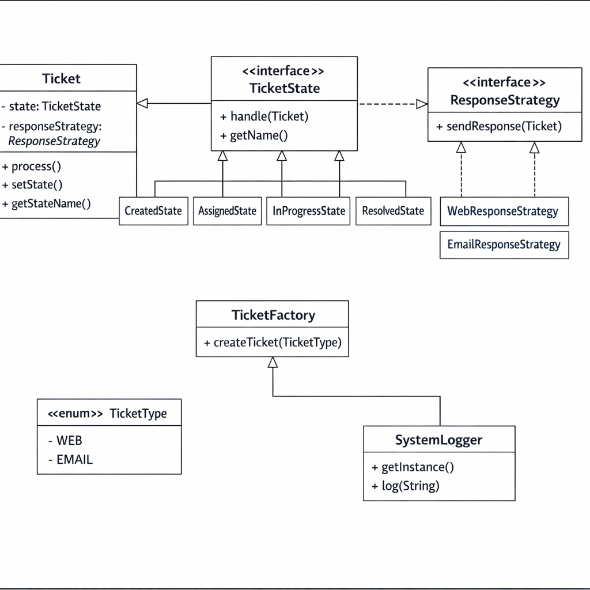

سیستم پشتیبانی تیکت (Ticket Support System)

  

این مخزن شامل پیاده‌سازی اولیه‌ی یک سیستم ساده‌ی پشتیبانی تیکت است که برای یک تمرین طراحی شی‌گرا (Object-Oriented Design) ارائه شده است.

  

در این پروژه، سیستم به‌صورت مرحله‌به‌مرحله تحلیل و بازآرایی (Refactor) می‌شود و در این فرآیند از الگوهای طراحی (Design Patterns) استفاده خواهد شد.

  
  

##  بخش ۱) تشخیص زیرمسائل و الگوها
 در این بخش ما مسئله را به زیر مسئله های زیر میشکنیم:

  

### 1.1 ) مدیریت رفتار وابسته به وضعیت درخواست (Ticket Lifecycle)
در سیستم مدیریت تیکت، هر درخواست پشتیبانی در طول عمر خود وضعیت‌های مختلفی مانند «ایجاد شده»، «ارجاع داده شده»، «در حال رسیدگی»، «حل شده» و «بسته شده» را طی می‌کند.

رفتار سیستم (مانند امکان پردازش یا تغییر وضعیت) در هر یک از این وضعیت‌ها متفاوت است. در کد اولیه، این تفاوت رفتارها معمولاً با شرط‌های متعدد (`if / else` یا `switch`) پیاده‌سازی شده که باعث پیچیدگی و کاهش قابلیت نگهداری می‌شود.
#### الگوی پیشنهادی : الگوی State
این الگو را انتخاب کردیم به علت اینکه رفتار سیستم مستقیماً به وضعیت فعلی تیکت وابسته است و هر وضعیت منطق مخصوص به خود را دارد. این الگو امکان حذف شرط‌های پیچیده و افزودن وضعیت‌های جدید بدون تغییر در کلاس اصلی را فراهم می‌کند.

#### مراحل اعمال الگو : 
- تعریف یک اینترفیس `TicketState` شامل متدهایی برای رفتارهای وابسته به وضعیت (مانند `handle()` یا `next()`).
- پیاده‌سازی کلاس‌های مجزا برای هر وضعیت (`CreatedState`، `AssignedState`، `InProgressState`، `ResolvedState`، `ClosedState`).
- نگهداری یک مرجع از `TicketState` در کلاس `Ticket` و واگذاری رفتار به آن.
- تغییر وضعیت از طریق جایگزینی state فعلی، بدون استفاده از شرط‌های کنترلی.
- 
### 1.2 ) پاسخ‌دهی متفاوت بر اساس نوع درخواست
در طول رسیدگی به تیکت، سیستم باید پاسخ مناسبی به درخواست ارسال کند. نوع پاسخ می‌تواند بسته به کانال ورودی (مثلاً WEB یا EMAIL) متفاوت باشد.

در کد اولیه، این تفاوت معمولاً با شرط‌های مستقیم درون منطق پردازش انجام می‌شود که توسعه‌پذیری سیستم را کاهش می‌دهد.

#### الگوی پیشنهادی : **الگوی Strategy**
این الگو را انتخاب کردیم به علت اینکه الگوریتم پاسخ‌دهی می‌تواند به چندین روش مختلف انجام شود و این روش‌ها باید به‌صورت قابل تعویض و مستقل از کلاس `Ticket` تعریف شوند.

#### مراحل اعمال الگو : 
- تعریف اینترفیس `ResponseStrategy` با متدی مانند `sendResponse()`.
- پیاده‌سازی کلاس‌های مختلف برای هر نوع پاسخ (`WebResponseStrategy` و `EmailResponseStrategy`).
- نگهداری یک شیء از نوع `ResponseStrategy` در کلاس `Ticket`.
- فراخوانی متد پاسخ‌دهی بدون وابستگی به پیاده‌سازی مشخص، و بدون استفاده از `if / else`.

### 1.3 ) ایجاد تیکت‌ها بر اساس کانال ورودی
ساختن یک تیکت جدید شامل تنظیم وضعیت اولیه و تعیین نوع پاسخ‌دهی مناسب است. اگر این منطق ساخت مستقیماً در بخش‌های مختلف سیستم انجام شود، وابستگی شدید و تکرار کد به‌وجود می‌آید.

#### الگوی پیشنهادی : **الگوی Factory**
این الگو را انتخاب کردیم به علت اینکه فرآیند ایجاد تیکت شامل تصمیم‌گیری بر اساس نوع کانال (WEB / EMAIL) است و بهتر است این منطق ساخت در یک نقطهٔ متمرکز قرار گیرد.

#### مراحل اعمال الگو : 
- تعریف یک enum به نام `TicketType` برای مشخص‌کردن نوع کانال.
- ایجاد کلاس `TicketFactory` با یک متد static برای ساخت تیکت.
- تعیین `ResponseStrategy` و وضعیت اولیه تیکت درون Factory.
- حذف ایجاد مستقیم (`new`) تیکت از سایر بخش‌های سیستم.

###  1.4() ثبت رویدادهای سیستم
در پایان پردازش هر تیکت، لازم است یک رویداد (Log) از عملیات انجام‌شده ثبت شود. این ثبت باید به‌صورت یکنواخت و متمرکز انجام شود.

#### الگوی پیشنهادی : **الگوی Singleton**
این الگو را انتخاب کردیم به علت اینکه سیستم تنها به یک نمونه از Logger نیاز دارد و وجود چندین نمونه می‌تواند باعث ناهماهنگی در ثبت رویدادها شود.

#### مراحل اعمال الگو : 
- تعریف کلاس `SystemLogger` با constructor خصوصی.
- ایجاد یک instance یکتا و قابل دسترس سراسری.
- استفاده از Logger در متدهای پردازش تیکت برای ثبت پیام‌های سیستمی.

## 2. نمودار کلاس (Class Diagram)

  

## بخش (4) تحلیل شی‌گرا (SOLID + PLK + CRP)

پس از اعمال الگوهای طراحی، سیستم از نظر اصل **Open/Closed (OCP)** بهبود یافته است؛ به‌طوری که برای افزودن وضعیت جدید یا نوع پاسخ جدید، نیازی به تغییر کدهای موجود در کلاس `Ticket` نیست و تنها با افزودن یک کلاس جدید، سیستم توسعه می‌یابد.

از منظر **Single Responsibility (SRP)** و **Common Reuse Principle (CRP)**، مسئولیت‌های مختلف مانند مدیریت وضعیت، پاسخ‌دهی و ثبت رویداد از کلاس اصلی جدا شده و هر کدام در کلاس‌های مستقل قرار گرفته‌اند که باعث کاهش وابستگی و افزایش قابلیت استفادهٔ مجدد شده است.

همچنین با رعایت **Principle of Least Knowledge (PLK)**، کلاس `Ticket` تنها با abstractionها (State و Strategy) در تعامل است و از جزئیات پیاده‌سازی بی‌اطلاع می‌ماند که این موضوع خوانایی، نگهداری و تست‌پذیری سیستم را بهبود داده است.